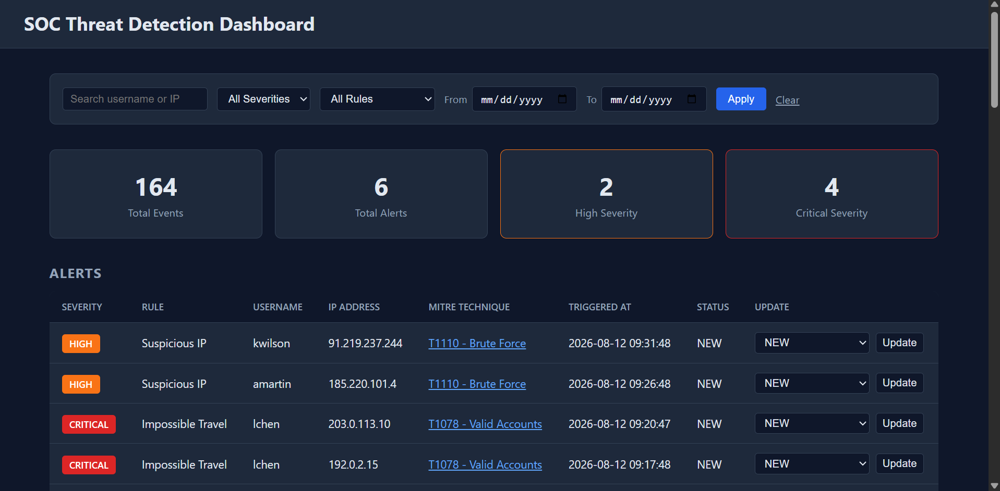
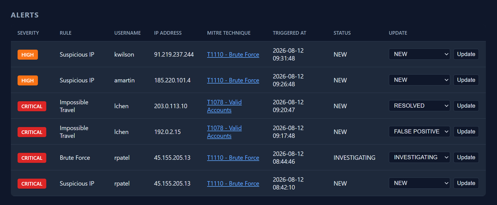
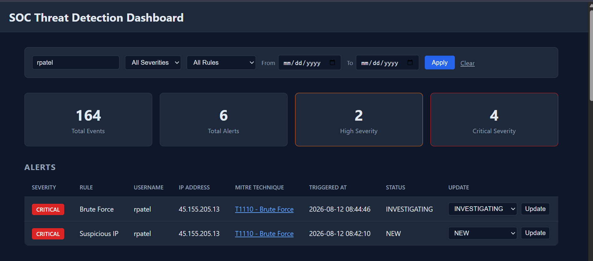
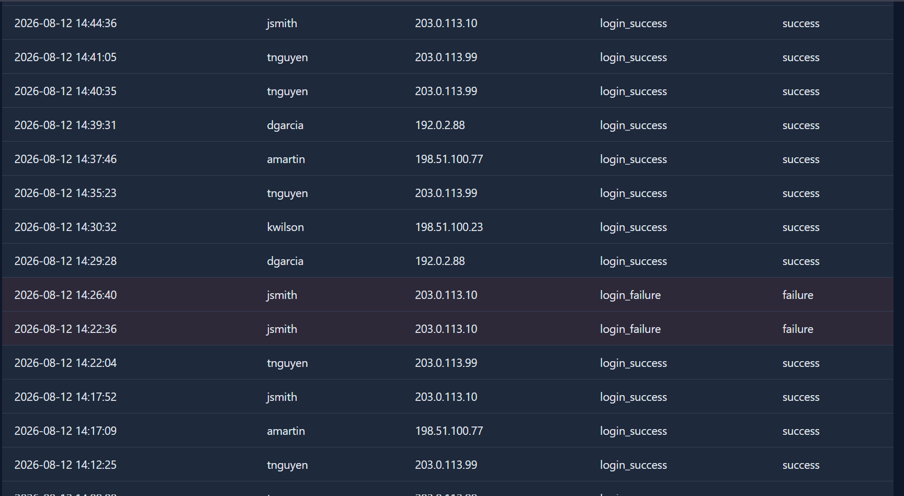
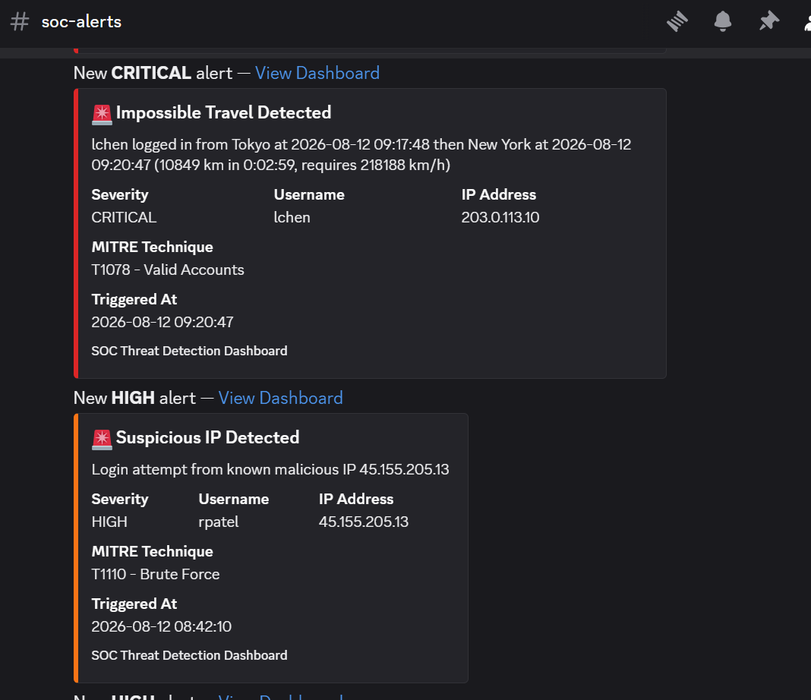
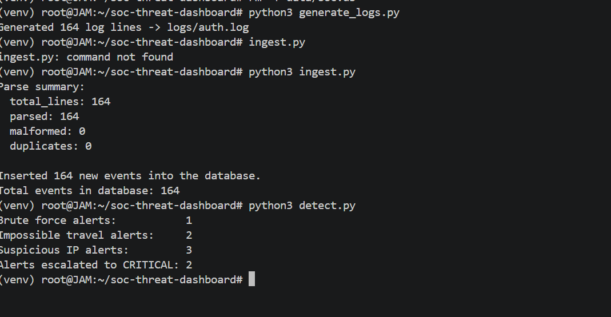

# SOC Threat Detection Dashboard

A security monitoring system that generates, parses, and analyzes authentication logs using custom detection rules for brute force, impossible travel, and suspicious IP activity. Alerts are mapped to MITRE ATT&CK, prioritized by severity, displayed in an analyst dashboard, and delivered through immediate Discord webhook notifications.

## Why I Built This / What I Learned

 I wanted a project that forced me to implement real SOC detection concerns end-to-end such as parsing untrusted log data, windowed correlation logic, and MITRE ATT&CK mapping. This project allowed me to understand what it really takes to build a detection engine, from a two-pointer sliding window for brute force to a haversine distance calculation for impossible travel to cross-rule severity escalation.

## Live Demo

Dashboard: https://soc-threat-detection-dashboard.onrender.com/

Note: hosted on Render's free tier, which sleeps after 15 minutes of inactivity (first request may take 30–60s to wake up) and has an ephemeral filesystem. Because the app is self-seeding — on startup, if the database is empty it automatically regenerates logs, re-ingests, and re-runs detection — the live demo always has a full set of alerts to look at, even right after a cold start or a redeploy.

## Tech Stack

| Layer | Choice |
|---|---|
| Backend | Flask 3, Python 3 |
| Database | SQLite (stdlib `sqlite3`) |
| Config | PyYAML (`config.yml`) |
| Secrets | `python-dotenv` (`.env`, gitignored) |
| Notifications | Discord webhook via `requests` |
| Frontend | Server-rendered Jinja2 templates, hand-written CSS (dark theme, no JS framework) |
| Hosting | Render, Gunicorn as the production WSGI server |
| Dev Environment | WSL2 (Ubuntu), VS Code |

## Features

**Synthetic log generator**
- Writes pipe-delimited auth logs mimicking a real auth log format
- Normal background traffic plus three injected attack patterns (brute force, impossible travel, suspicious IP)
- Randomized around a base timestamp, so every run produces a new, still-valid incident

**Fault-tolerant log parser**
- Single-pass regex extraction of all fields
- Malformed lines are counted and skipped rather than crashing the run
- Duplicate lines are detected and skipped

**Storage**
- SQLite `events` and `alerts` tables
- `UNIQUE` constraint on `events` as a second layer of duplicate protection beyond the parser

**Detection engine**
- Brute force (two-pointer sliding window), impossible travel (haversine distance/speed), suspicious IP, and cross-rule severity escalation — see below

**MITRE ATT&CK mapping**
- Every alert carries a technique ID/name and links out to the official ATT&CK page

**Alert lifecycle management**
- NEW → INVESTIGATING → FALSE POSITIVE / RESOLVED, validated against a fixed status enum

**Dashboard**
- Metrics row, color-coded alerts table, events timeline, inline status updates
- Search (`?q=`) and filters (`?severity=`, `?rule=`, `?start_date=`/`?end_date=`) as URL query params, so filtered views are shareable/bookmarkable links

**Discord webhook notifications**
-  Immediate webhook notifications when detection rules trigger, isolated from the detection pipeline so notification failures do not prevent alert persistence.

**Config-driven thresholds**
- Detection sensitivity lives in `config.yml`, not hardcoded in Python

## Architecture Diagram

```text
logs/auth.log            (generate_logs.py — synthetic auth events + 3 injected attacks)
      │
      ▼
log_parser.py            (regex extraction, malformed/duplicate handling, stats)
      │
      ▼
data/soc.db              events table (SQLite, INSERT OR IGNORE, UNIQUE constraint)
      │
      ▼
detect.py                brute force / impossible travel / suspicious IP / escalation
      │                    ──▶ discord_notify.py ──▶ Discord webhook
      ▼
data/soc.db              alerts table (rule, severity, MITRE technique, status)
      │
      ▼
app.py (Flask)           dashboard.html — metrics, alerts table, events timeline,
                          search + filters, status updates
```

`config.py` / `config.yml` and `mitre.py` sit alongside `detect.py` as reference/data layers — thresholds and technique metadata are never hardcoded into the detection logic or the templates.

## Engineering & Security Design

- **Injection (A03)** — every dashboard filter (search, severity, rule, date range) is built with parameterized `?` placeholders, never string interpolation, so user-controlled query params can't reach raw SQL.
- **Security Logging & Monitoring Failures (A09)** — this project exists to be the monitoring layer: every login attempt is captured as an event, every rule match is recorded as an alert with a timestamp and technique mapping, and parser failures and duplicate records are explicitly counted rather than silently ignored.
- **Security Misconfiguration / Secrets Exposure (A05/A02)** — the Discord webhook URL is read from `.env` (gitignored) via `python-dotenv`, never hardcoded or committed.
- **Defense-in-depth deduplication** — duplicates are caught at three independent layers: the parser (`seen` set), the database (`UNIQUE(timestamp, username, ip_address, event_type)` on `events`), and the detection engine (`_alert_exists` before inserting an alert) — so re-running the pipeline on the same data is idempotent and never spams duplicate alerts.
- **Notification failure isolation** — `discord_notify.py` is a separate module from `detect.py`; if the webhook is unset or Discord is unreachable, the exception is caught and logged, never raised. Notification failures are caught and logged without preventing the alert from being persisted.
- **No double-notification on escalation** — Discord messages fire with the alert's severity at creation time. If severity escalation later bumps an alert to CRITICAL, that's reflected on the dashboard but does not trigger a second Discord message for the same incident.
- **Status integrity via allowlist** — `update_alert_status()` rejects any value outside `NEW / INVESTIGATING / FALSE POSITIVE / RESOLVED`, mirroring how real SIEM tools use enums/dropdowns instead of free text.
- **Config-driven detection** — thresholds, time windows, and the known-bad-IP list live in `config.yml`, separating "what counts as suspicious" from the code that evaluates it, so sensitivity can be retuned without a code change.


### Detection Rules & MITRE ATT&CK Mapping

| Rule | Logic | Default threshold | Severity | MITRE technique |
|---|---|---|---|---|
| **Brute Force** | Two-pointer sliding-window scan over each IP's failed logins, sorted by time | >5 failures within a 10-minute window | HIGH | [T1110 – Brute Force](https://attack.mitre.org/techniques/T1110/) |
| **Impossible Travel** | Haversine great-circle distance between two consecutive successful logins for the same user, divided by elapsed time, compared against commercial-jet cruise speed | Required speed > 900 km/h within a 30-minute window | CRITICAL | [T1078 – Valid Accounts](https://attack.mitre.org/techniques/T1078/) |
| **Suspicious IP** | Every login checked against a known-bad IP list (`config.yml`) | Any match | HIGH | [T1110 – Brute Force](https://attack.mitre.org/techniques/T1110/) |
| **Severity Escalation** | If a user accumulates ≥2 HIGH alerts within a 30-minute window, all alerts in that cluster are bumped | 2+ HIGH alerts / 30 minutes | → CRITICAL | — |

**Why impossible travel isn't a naive rule:** rather than just flagging "different country within N minutes," the engine calculates the actual great-circle distance between the two login locations and derives the speed required to make that trip. Only when that speed exceeds what a commercial aircraft can achieve does it fire — a more defensible rule than a flat geography/time check.


## API Endpoints

This is a server-rendered dashboard, not a JSON API, so the surface is small — everything an analyst does goes through these two routes:

| Method | Endpoint | Description |
|---|---|---|
| GET | `/` | Dashboard home. Renders metrics, the alerts table, and the events timeline. Accepts `q`, `severity`, `rule`, `start_date`, `end_date` query params for search/filtering. |
| POST | `/alerts/<id>/status` | Updates one alert's status via `update_alert_status()`, then redirects back to `/`. Rejects any status outside the fixed enum. |

## Screenshots

**Dashboard overview** — metrics row, search/filter bar, and the alerts table


**Alerts table** — severity color coding, MITRE technique links, and the per-alert status controls


**Severity escalation** — `rpatel`'s Brute Force and Suspicious IP alerts, two independent rules on the same incident, both bumped to CRITICAL


**Events timeline** — chronological events, color coded by success/failure


**Discord webhook notifications** — real alerts delivered to `#soc-alerts`, colored by severity


**Pipeline run** — `generate_logs.py` → `ingest.py` → `detect.py`, end to end


## Known Limitations

Being upfront about a couple of gaps rather than hoping nobody notices:

- **Password spraying isn't implemented.** The config and detection engine only cover single-username brute force, not the "many usernames, one IP" pattern that maps to T1110.003.
- **Filters aren't fully applied to the events timeline.** Free-text search (`q`) filters both the alerts table and the events timeline; the severity/rule/date filters currently only narrow the alerts table.
- **No dashboard authentication.** The dashboard itself has no login — fine for a personal demo, not something to expose beyond that as-is.

## Running Locally

```bash
git clone <your-repo-url>
cd soc-threat-dashboard
python3 -m venv venv
source venv/bin/activate        # Windows: venv\Scripts\activate

pip install -r requirements.txt
```

Create a `.env` file (see `.env.example` for the required variables) with your own `DISCORD_WEBHOOK_URL`.

Generate a fresh incident, load it, and run detection:

```bash
python3 generate_logs.py        # writes logs/auth.log
python3 ingest.py               # parses + loads into data/soc.db
python3 detect.py               # runs detection rules, fires Discord alerts
```

Start the dashboard:

```bash
python3 app.py                  # http://localhost:5000
```

The app is self-seeding — if `data/soc.db` is empty when it starts, it runs the generator → parser → detector pipeline automatically, so there's always sample data to look at with zero manual steps.

### Discord webhook setup

1. In your Discord server: **Server Settings → Integrations → Webhooks → New Webhook**.
2. Copy the webhook URL.
3. Add it to `.env`:
   ```
   DISCORD_WEBHOOK_URL=https://discord.com/api/webhooks/...
   DASHBOARD_URL=http://localhost:5000
   ```

## Future Improvements

- Password spraying detection (`T1110.003`) — many failed logins across many usernames from one IP, distinct from the single-username brute-force rule already implemented.
- Automated tests for the detection engine (particularly the sliding-window and haversine logic) so threshold changes in `config.yml` can be validated against known fixtures, instead of relying on the manual testing above.
- Apply the severity/rule/date filters to the events timeline as well as the alerts table.
- Pagination for the events timeline instead of a fixed 50-row limit.
- Authentication on the dashboard itself before deploying anywhere beyond a personal demo.
- A `known_bad_ips` feed that can be refreshed from a real threat-intel source instead of a static list.